# CTF Infrastructure: Initial Setup Stage

## Objectives
Welcome! The objective of this module to complete a number of important prerequisites to the **Infrastructure Build Process**. More specifically, we will: 
1. Create a LastPass Account for the CTF
2. Create a Google Account and a Google Cloud Platform (GCP) Project for Your CTF
3. Set up the CTF Management VM
4. Create a Gcloud Service Account and Activate it
5. Generate SSH Keys for Infrastructure Build Process Accounts

## Prerequisites
Chik-p is meant to be used as a template. If you have not already clicked the green "Use This Template" button on Chik-p's Github page, please do so! This action will create a copy of Chik-p's repository so that you can customize it for your CTF.

## Infrastructure Build Process: Important Accounts

Before fulfilling this stage's objectives, the CTF infrastructure administrator should be aware of following accounts. Without these accounts, the infrastructure build process **cannot** succeed.

### The GCP Account 
This is a personal or organizational Google account (think gmail) capable of creating Google Cloud Platform (GCP) projects. This account owns the CTF's dedicated GCP project, and is the most powerful account in the environment. This account is created during the **Initial Setup Stage**.  

### The Gcloud Service Account
The gcloud service account is used to provision cloud resources using the `gcloud` commandline utility during the **Cloud Resource Provisioning Stage**. It has full administrative access to all cloud resources in the CTF project including hosts, managed DNS zones, GKE clusters, etc. `gcloud` authenticates to GCP as this service account using a private key obtained from the Google Cloud Console. 

### The CTF Github Account 
During the infrastructure build process, Ansible clones this respository to retrieve and deploy CTF services (CTFd, Nginx, etc.). Chik-p assumes that the CTF Infrastructure Administrator stores their customized copy of Chik-p in a private Github repository. As a consequence of this assumption, the CTF Infrastructure Administrator must generate an SSH key pair for hosts in the CTF in order to give them access to this Github repository.

The public key must be uploaded manually to the CTF's Github account. Later, an Ansible playbook in the **Host Configuration Stage** distributes the associated private key to each host in the CTF environment.  

### The `ansible` user
The `ansible` user is a local account that exists on every host in the CTF environment. Ansible logs in as this user when it needs to run playbooks that require root privileges on the target host. These playbooks are often concerned with creating users, installing packages, and modifying system parameters. The `ansible` user is created and its public key is uploaded to each host in the CTF environment by `gcloud` (as part of the host's creation process).

### The `ctf` user
The `ctf` user is a local account that exists on every host in the CTF environment. The `ctf` user serves two purposes:

1. During the initial infrastructure build process, Ansible logs in as this user when it needs to deploy services or run playbooks that DO NOT require root privileges on the target host. In that sense, it serves as a second Ansible service account.
2. It is used by the CTF infrastructure administrator to carry out day to day administrative tasks (such as starting and stopping services). By default, it is a member of the `sudo` and `docker` groups. 

The `ctf` user is created and its public key is uploaded to each host in the CTF environment by Ansible during the **Host Configuration stage**.

### How do I generate SSH keys for these accounts?
We will show you! SSH keys for the Gcloud Service Account, the CTF Github Account, the `ansible` user, and the `ctf` user will be generated in the **Initial Setup Stage** (as in very soon).

### Are there any other accounts?
Oh yes! Plenty! There are accounts associated with every service (CTFd, ELK, etc.). We leave a discussion of each of these account to each service's dedicated readme.

## **Objective #1: Create a LastPass Account for the CTF**

LastPass will store CTF credentials. These credentials will be pulled dynamically by Ansible during the infrastructure build process (using the `lpass` commandline utility). And in doing so, we mitigate the risk of accidentally committing passwords to Github repositories or hardcoding them in our code.

Installing LastPass is easy. If you need help, follow the instructions in this [video](https://www.youtube.com/watch?v=PDVJR7RXvzs). Don't forget to choose a **strong memorable Master Password** and enable **Multi-Factor-Authentication (MFA)**.

## **Objective #2: Create a Google Account and a Google Cloud Platform (GCP) Project for Your CTF**

### **Step #1: Create a CTF Google Account**

Follow best practices:
1. Store the username and password in a password manager of your choosing.
2. Limit access to a handful of trusted individuals. If this account is compromised, everything is compromised.
3. Enable MFA.

### **Step #2: Log into the GCP cloud console at:** [**https://console.google.cloud.com**](https://console.google.cloud.com/)


<br />

### **Step #3: Create a CTF Infrastructure Project**
1. This project will contain all CTF-related cloud resources.
2. The most important parameter is the **Project ID.** It uniquely identifies your project and will be used for resource provisioning and hosted challenge deployment.
3. Click **"New Project"** and **Fill in the Form**.

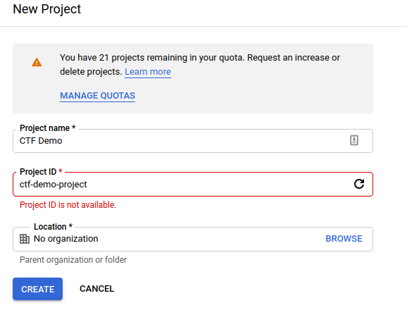

<br />

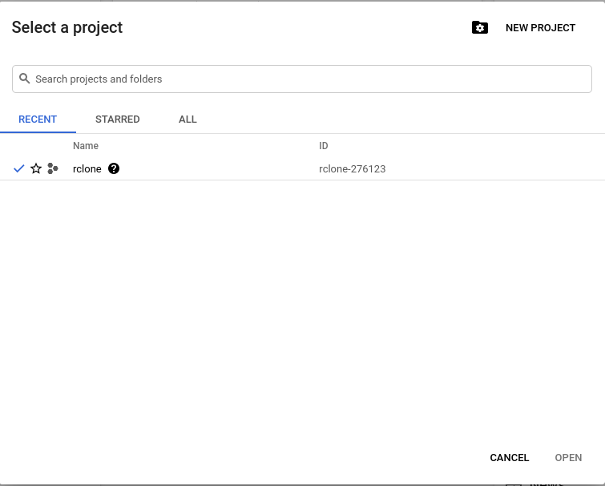

<br />

### **Step #4: Enable Cloud APIs**
In the Cloud Console search bar:
1. Search for **"Compute Engine API"** and Click **"Enable"**.
2. Search for **"Cloud Resource Manager API"** in the Search Bar and Click **"Enable"**.
3. Search for **"Kubernetes Engine API"** in the Search Bar and Click **"Enable"**.
4. Search for **"Cloud DNS API"** in the Search Bar and Click **"Enable"**.

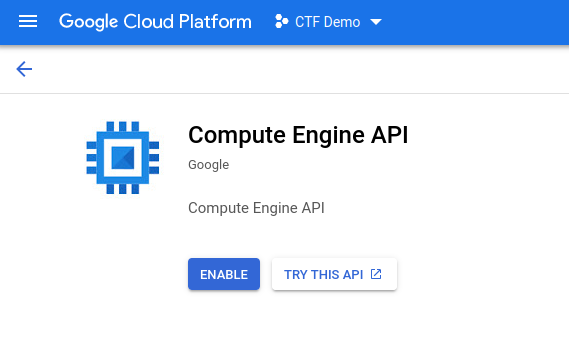

Your CTF's GCP project is now all set up!

<br />

## **Objective #3: Set up the CTF Management VM**

The CTF Management VM is used to deploy and manage CTF infrastructure.

### The Administration VM
A local Ubuntu Linux VM with 2 CPUs, 6-8GB of RAM, and a 100GB of storage space is strongly recommended.


### 0-admin-machine-setup.sh

This bash script will install all required utilities including:
1. docker
2. docker-compose
3. gcloud
4. kubectl
5. ansible
6. lastpass-cli
7. certbot
8. ctfcli

### Step #1: Clone This Repository

```
git clone <repo_url>
```

### Step #2: Run `0-admin-machine-setup.sh`

1. Make the script executable.

```

chmod 700 0-admin-machine-setup.sh

```

2. Run the script

```

./0-admin-machine-setup.sh

```

4. If the script runs without errors, you have all the tools you need!


## **Objective #4: Create a Gcloud Service Account and Activate it**

Complete the following steps on the CTF Infrastructure Administrator's management VM.

### **Step #1: Create a Service Account for the CTF Infrastructure Project.**

- This account will be used to provision cloud resources (such as Google Compute Engine VMs) programmatically.
- Search for **"Service Accounts"** in the Search Bar of the Google Cloud Console.
  - Fill in the form with the following parameters:
    - **Service Account Name**: ctf-infra-manager
    - **Service Account ID**: ctf-infra-manager
    - **Service Account Description**: A service account used to deploy and provision CTF infrastructure.
  - Assign the following **roles** to your service account:
    - **Compute Admin**: Full management of all Compute Engine resources.
    - **Kubernetes Cluster Admin**: Management of Kubernetes clusters.
    - **Service Account User**: Run operations as the service account.
    - **Storage Admin**: Push images to Container Registry.
    - **DNS Administrator**: Full read-write access to DNS resources.
  - Skip the **"Grant users access to this service account"** section.
  - Click **"Create"**.

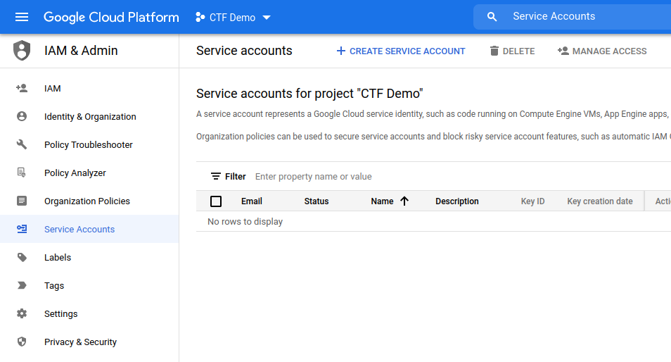

<br />

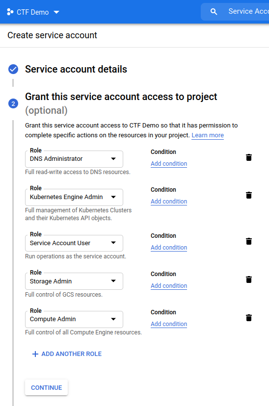

<br />

### **Step #2: Create a Private Key for your Service Account**

- You will use this key to authenticate to Google Cloud APIs when provisioning cloud resources programmatically using `gcloud`.
  - Click the service account name
  - Click **"Keys"** > **"Add Key"** > **"Create New Key"**
  - Select **"JSON"** for the key type.
  - As soon as you click **"Create"**, the service account key will be created then automatically downloaded.
  - Store this key in `~/.ssh/`. If the `.ssh` directory does not exist, create it.

  ```
  mv <insert_key_here_name>.json ~/.ssh/ 
  ```

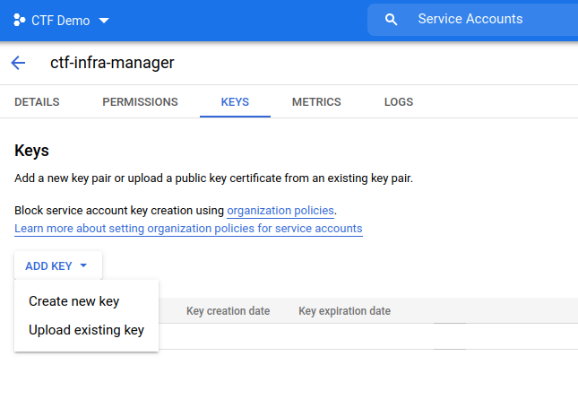

<br />

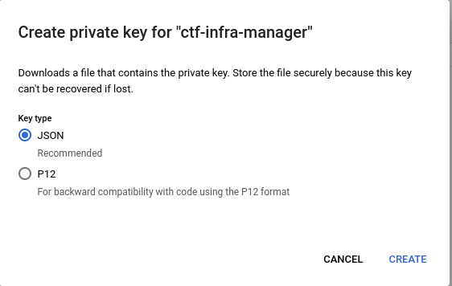

<br />

<br />

### **Step #4: Activate the Gcloud Service Account on the CTF Management VM**

1. Make `1-admin-account-setup.sh` executable.

```
chmod 700 0-admin-account-setup.sh
```

2. Open the script and fill in the **Service Account Name**, **Service Account Key Path**, and **Project ID**.

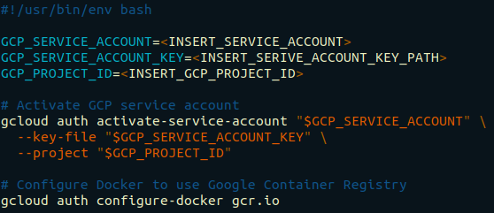

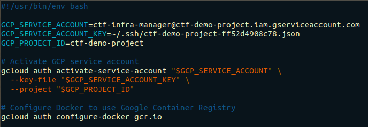

<br />

3. Run the script

```
./1-admin-account-setup.sh
```

4. If everything worked out, you are now ready to provision cloud resources using `gcloud`. (But don't; one more objective to go!) 

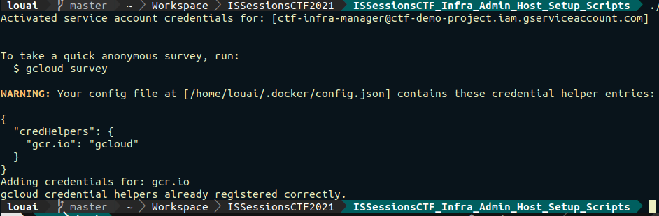

<br />

## **Objective #5: Generate SSH Keys for Infrastructure Build Process Accounts**

Next, we generate three SSH key pairs on the CTF's Management VM and store them in the `~/.ssh` directory.
- The first key pair allows Ansible to authenticate to CTF hosts and run playbooks as the `ansible` user.
- The second key pair allows Ansible to authenticate to CTF hosts as the `ctf` user. We also use them to login as the `ctf` user for day-to-day management. 
- The third set of keys allow CTF hosts to clone the Github repository containing CTF services during the **Service Deployment Stage**.

### First Key Pair (Ansible Account)

On the administration VM, run:
```
ssh-keygen -b 4096 -t rsa -f ~/.ssh/ansible -q -N ""
```

Open `~/.ssh/ansible.pub` and prepend everything with `ansible:`. This indicates to GCP that we wish to create an `ansible` user on virtual machine creation.

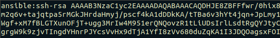

### Second Key Pair (CTF Account)
On the administration VM, run:
```
ssh-keygen -b 4096 -t rsa -f ~/.ssh/ctf -q -N ""
```

### Third Key Pair (Repository Access Key)
On the administration VM, run:
```
ssh-keygen -b 4096 -t rsa -f ~/.ssh/ctf-repo-key -q -N ""
```
<br />

Add the CTF repository access key (`~/.ssh/ctf-repo-key.pub`) to your Github account.
1. Log in to your Github account where the CTF repositories are hosted.
2. Click your icon in the far-right corner of the screen.
3. Click **Settings**
4. On the left hand side of the screen, click **"SSH and GPG Keys"**
5. Click **"New SSH Key"**
6. Give the key an easy to remember **Title**
7. Copy and paste the contents of `ctf-repo-key.pub` into the **Key** field.
8. Click **"Add SSH Key"**

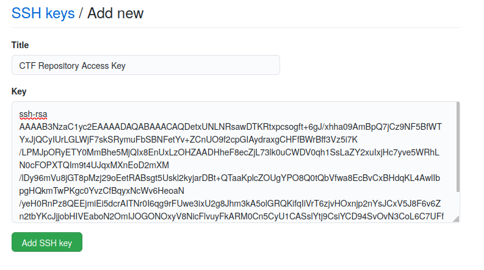

## Next Steps
Proceed to the **Cloud Resource Provisioning Stage**.


