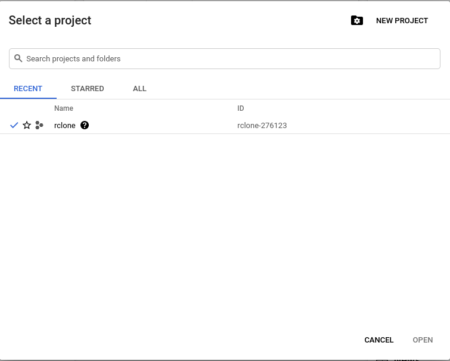
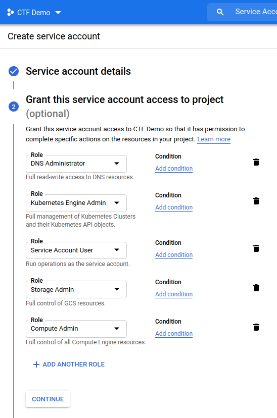
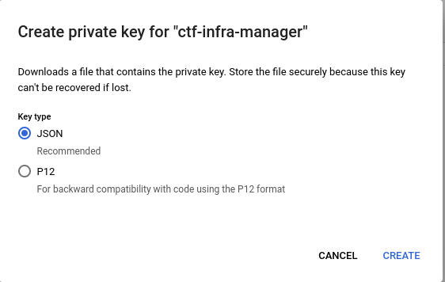
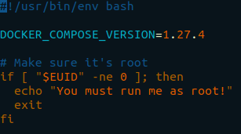
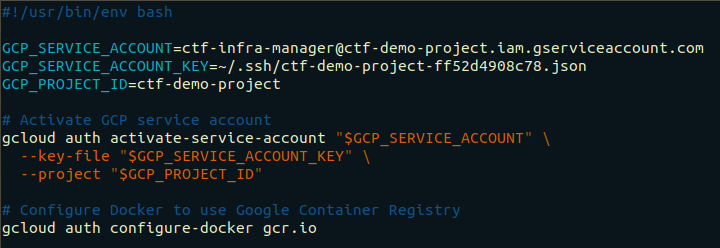
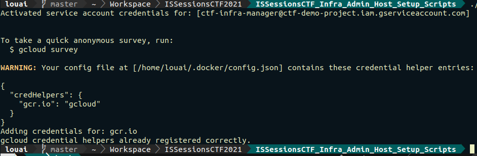
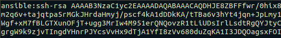
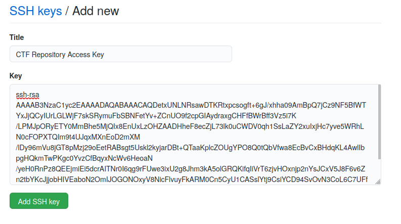

# CTF Infrastructure: Initial Setup Steps

## Objectives
Welcome! The objective of this module to complete a number of important prerequisites to the infrastructure build process. More specifically, we must: 
1. Create a LastPass Account for the CTF
2. Create a Google Cloud Platform (GCP) CTF project
3. Generate SSH keys for important local accounts
4. Set up the CTF Infrastructure Administrator's Management Virtual Machine (VM)

## Cloud and Local Accounts

The Infrastructure Administrator must be aware of the following set of cloud and local accounts and their associated credentials.

### Cloud Accounts

**GCP Account**: 

**GCP CTF Project Service Account**: This GCP service account is used to provision GCP resources using `gcloud`. It has full administrative access to all cloud resources including hosts, managed DNS zones, GKE clusters, etc. `gcloud` authenticates to GCP as this service account from the administration VM using a private key obtained from the Google Cloud Console.   

**CTF Github Account**: CTF-related repositories are hosted on Github. As part of the initial deployment, Ansible playbooks executing on hosts in the CTF environment pull service repositories from Github (CTFd, Wireguard, etc.). These repositories are private and thus authentication to Github via an SSH key is required. The CTF infrastructure administrator generates an SSH keypair, a public key and a private key, to facilitate access to the Github repository. The administrator adds the public key to the CTF's Github account. An ansible playbook (3-setup-credentials.yml) distributes the associated private key to each host in the CTF environment.

### Local Accounts

**`ansible` user**:  Ansible uses the `ansible` user to execute playbooks on target hosts in the CTF environment. Playbooks executed using the `ansible` user require root privileges as they are often concerned with creating users, installing packages, and modifying system parameters. Ansible uses an SSH key generated by the CTF infrastructure administrator to authenticate as the `ansible` user from the administration VM. The ansible user's public key is uploaded to each host as it is being created by `gcloud` in [ISSessionsCTF-Infra-GCP-Build-Scripts](https://github.com/abboudl/ISSessionsCTF-Infra-ISSessionsCTF-Infra-GCP-Build-Scripts/.

**`ctf` user**: The `ctf` user serves two purposes:
  1. In the initial deployment, this user executes ansible playbooks that DO NOT require root privileges on the target hosts. In that sense, it serves as a second Ansible service account.
  2. It is used by the CTF infrastructure administrator to carry out day to day administrative tasks (such as starting and stopping services). By default, it is a member of the `sudo` and `docker` groups.

  The CTF infrastructure administrator generates an SSH key for the `ctf` user on the administration VM for the purposes of authentication. The `ctf` user is created automatically and its public key is uploaded to each host in the CTF environment by ansible (as part of the 3-setup-credentials.yml playbook in [ISSessionsCTF-Infra-Ansible-Playbooks](https://github.com/abboudl/ISSessionsCTF-Infra-ISSessionsCTF-Infra-Ansible-Playbooks/.)

| Account/Credential       | LastPass Credential Name        | Description                                                                          |
| -------------------------|---------------------------------|--------------------------------------------------------------------------------------|
| ctf                      | ctf_user_pass                   | Password of the `ctf` user. The `ctf` user is created on each host by the Ansible notebook 4-setup-credentials.yml. The CTF infrastructure administrator uses an SSH key to login as the ctf user; the password is used to sudo to root if needed.|

## **Objective #1: Create a LastPass Account for the CTF**

LastPass will store password related to the CTF infrastructure. These passwords will be pulled dynamically by Ansible during the infrastructure build process (using the `lpass` commandline utility).  As a result, we mitiagte the risk of accidentally committing passwords to Github repositories or hardcoding them in our code.

Installing LastPass is easy. If you need help, follow the instructions in this [video](https://www.youtube.com/watch?v=PDVJR7RXvzs). Don't forget to choose a **strong Master Password** and enable **Multi-Factor-Authentication (MFA)**.

## **Objective #2: Create a Google Cloud Platform (GCP) CTF Project**

### **Step #1: Create a CTF Google account.**

Follow best practices:
1. Store the username and password in a password manager of your choosing.
2. Limit access to a handful of trusted individuals. If this account is compromised, everything is compromised.
3. Enable MFA.

### **Step #2: Log into the GCP cloud console at:** [**https://console.google.cloud.com**](https://console.google.cloud.com/)


<br />
### **Step #3: Create a CTF Infrastructure Project**
1. This project will contain all CTF-related cloud resources.
2. The most important parameter is the **Project ID.** It uniquely identifies your project and will be used for resource provisioning and hosted challenge deployment.
3. Click **"New Project"** and **Fill in the Form**.


<br />



<br />

### **Step #4: Create a Service Account for the CTF Infrastructure Project.**

- This account will be used to provision cloud resources (such as Google Compute Engine VMs) programmatically.
- Search for **"Service Accounts"** in the Search Bar of the Google Cloud Console.
  - Fill in the form with the following parameters:
    - **Service Account Name**: ctf-infra-manager
    - **Service Account ID**: ctf-infra-manager
    - **Service Account Description**: A service account used to deploy and provision CTF infrastructure.
  - Assign the following **roles** to your service account:
    - **Compute Admin**: Full management of all Compute Engine resources.
    - **Kubernetes Cluster Admin**: Management of Kubernetes clusters.
    - **Service Account User**: Run operations as the service account.
    - **Storage Admin**: Push images to Container Registry.
    - **DNS Administrator**: Full read-write access to DNS resources.
  - Skip the **"Grant users access to this service account"** section.
  - Click **"Create"**.


<br />



<br />

### **Step #5: Create a Private Key for your Service Account**

- You will use this key to authenticate to Google Cloud APIs when provisioning cloud resources programmatically using `gcloud`.
  - Click the service account name
  - Click **"Keys"** > **"Add Key"** > **"Create New Key"**
  - Select **"JSON"** for the key type.
  - As soon as you click **"Create"**, the service account key will be created then automatically downloaded.
  - Store this key in `~/.ssh/`. If the `.ssh` directory does not exist, create it.

  ```
  mv <insert_key_here_name>.json ~/.ssh/ 
  ```


<br />



<br />

### **Step #6: Enable Cloud APIs**
In the Cloud Console search bar:
1. Search for **"Compute Engine API"** and Click **"Enable"**.
2. Search for **"Cloud Resource Manager API"** in the Search Bar and Click **"Enable"**.
3. Search for **"Kubernetes Engine API"** in the Search Bar and Click **"Enable"**.
4. Search for **"Cloud DNS API"** in the Search Bar and Click **"Enable"**.


<br />

Your CTF's GCP project is now all set up!


## **Generate SSH keys for Important Local Accounts**


## **Adminstration Machine and Account Setup**

The administration virtual machine is used to manage CTF infrastructure.

```
VM Requirements: A local Ubuntu Linux VM with 2 CPUs, 6-8GB of RAM, and a 100GB of storage space is strongly recommended.
```

In this repository, there are two scripts:

1. **0-admin-machine-setup.sh** : this bash script will install all required utilities including:
	1. docker
	2. docker-compose
	3. gcloud
	4. kubectl
	5. ansible
	6. lastpass-cli
	7. certbot
	8. ctfcli

1. **1-admin-account-setup.sh** : this bash script will:
	1. activate your GCP service account so you may deploy resources using `gcloud`.
	2. authenticate the docker client to Google Container Registry where hosted challenge images will be pushed.

  <br />

### Preparation

1. Clone this repository.

```

git clone <repo_url>;

```

<br />

### The `0-admin-machine-setup.sh` Script

1. Set the execute bit on the script.

```

chmod 700 0-admin-machine-setup.sh

```

2. Open the script and update docker-compose to the latest version.



<br />

3. Run the script

```

./0-admin-machine-setup.sh

```

4. If the script runs without errors, you have all the tools you need.

<br />

### The `1-admin-account-setup.sh` Script

1. Set the execute bit on the script.

```

chmod 700 0-admin-account-setup.sh

```

2. Open the script and fill in the Service Account Name, Service Account Key Path, and Project ID.




<br />

3. Run the script

```

./1-admin-account-setup.sh

```

4. If everything worked out, you should see a message like this:



<br />

## SSH Key Generation

Next, we generate the the **`ansible` user's ssh keys**, the **`ctf` user's ssh keys:**, and the **ctf repository's ssh keys**. For a description of each set of credentials, see _______.

### `ansible` ssh key

On the administration VM, run:
```
ssh-keygen -b 4096 -t rsa -f ~/.ssh/ansible -q -N ""
```

Open `~/.ssh/ansible.pub` and prepend everything with `ansible:`. This indicates to GCP that we wish to create an `ansible` user on virtual machine creation.



### `ctf` ssh key
On the administration VM, run:
```
ssh-keygen -b 4096 -t rsa -f ~/.ssh/ctf -q -N ""
```

### ctf repository's ssh access key
On the administration VM, run:
```
ssh-keygen -b 4096 -t rsa -f ~/.ssh/ctf-repo-key -q -N ""
```
<br />

Add the CTF repository access key (`~/.ssh/ctf-repo-key.pub`) to your Github account.
1. Log in to your Github account where the CTF repositories are hosted.
2. Click your icon in the far-right corner of the screen.
3. Click **Settings**
4. On the left hand side of the screen, click **"SSH and GPG Keys"**
5. Click **"New SSH Key"**
6. Give the key an easy to remember **Title**
7. Copy and paste the contents of `ctf-repo-key.pub` into the **Key** field.
8. Click **"Add SSH Key"**




### Cloudflare
| Account/Credential       | LastPass Credential Name        | Description                                                                          |
| -------------------------|---------------------------------|--------------------------------------------------------------------------------------|
| cloudflare dns api token | ctf_cloudflare_dns_api_token    | Cloudflare API token certbot uses to request a letsencrypt certificate using the DNS challenge.|


