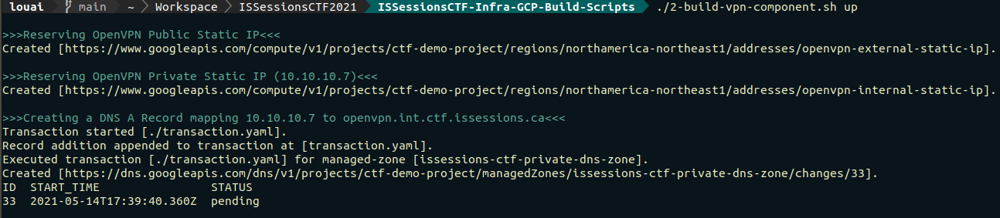
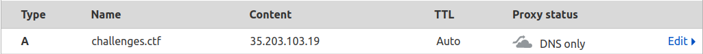

# CTF Infrastructure: Cloud Resource Provisioning Stage

## Purpose
The scripts in this repository provide the ability to programatically provision Google Cloud Platform (GCP) resources, such as hosts, IP addresses, and firewall rules. The intent is to cut the time required to build a full-fledged Capture the Flag (CTF) environment. The scripts rely heavily on the `gcloud` utility to privision resources.

**Important:** the scripts in this repository provision the hardware and cloud resources that services such as CTFd, Nginx, and HaProxy rely on, BUT they do not deploy these services themselves. A deployment guide for each of these services is provided in later stages. 

## Prerequisites
Ensure you have successfully completed all objectives in **0-Initial-Setup-Stage**. Most importantly, `~/.ssh/ansible` and `~/.ssh/ansible.pub` must have been created and the GCloud Service Account should have been activated using `0-admin-account-setup.sh`.

You can check which Gcloud service account is active using:
```
gcloud config list
```

## Script Organization

Each script in the Cloud Resource Provisioning Stage describes a modular logical component in a traditional CTF environment including:
1. **The Network Component**: provisions a virtual private cloud (VPC) network, subnets, basic firewall rules, DNS zones, etc. This is the base component for all other scripts. Implemented by: `1-build-network-component.sh`. 
2. **The VPN Componet**: provisions resources associated with a VPN gateway such as the Wireguard host providing administrators access to the environment. Implemented by: `2-build-vpn-component.sh`. 
3. **The Scoreboard Component**: provisions resources associated with the CTF scoreboard and file-based challenges (as opposed to hosted challenges) such as the CTFd host and the Nginx proxy. Implemented by: `3-build-scoreboard-component.sh`. 
4. **The Monitoring Component**: provisions resources related to CTF logging and monitoring such as the ELK host. Implemented by: `4-build-monitoring-component.sh`.
5. **The Hosted Challenges Component**: provisions resources related to hosted challenges such as the GKE Kubernetes cluster and the HAProxy host. Implemented by: `5-build-hosted-challenges-component.sh`. 

### Modular Components

The scripts are numbered by **order of execution**, however the CTF infrastructure administrator need not use all components at once or at all. At the moment, the following configurations are viable:
- **Full Platter**: run all scripts.
- **Blind Bandit:** `1-build-network-component.sh` -> `2-build-vpn-component.sh` -> `3-build-scoreboard-component.sh` -> `5-build-hosted-challenges-component.sh`
- **Keep it Simple, Stupid!:** `1-build-network-component.sh` -> `2-build-vpn-component.sh` -> `3-build-scoreboard-component.sh`

Finally, there is nothing stopping the CTF infrastructure administrator(s) from **modifying a component** or **adding new components** to suit their needs. In fact, this is expected and recommended. 

### Deployment Order
You should know that GCP resources are often dependent on each other. As such, when building the infrastructure, run scripts **in ascending order**. When tearing down infrastructure, run in scripts in **descending order**.
<br />

## Step-by-Step Instructions: Cloud Resource Provisioning Process

The `config.sh` file is imported by all other scripts in the repository. It gives the CTF Infrastructure Administrator the ability to customize the deployment by exposing several common parameters such as subnet ranges, IP addresses, fully qualified domain names, OS image versions, CPU, memory, and disk allocation. A description of each parameter is provided inside `config.sh`.
<br />

Before we proceed, note that all commands must be run on the Infrastructure Management VM.

1. Open `config.sh` and edit the value of **ANSIBLE_PUBLIC_KEY_PATH** to point to the path of the ansible public key on disk. If you followed the instructions in **0-Initial-Setup-Stage**, this should be its path: `~/.ssh/ansible.pub`.
2. Edit other parameters as needed. Note that:
  - You probably want to use a domain other than `issessions.ca` if you do not own that domain.
  - You may wish to give VMs more or less resources.
  - You may wish to upgrade the OS images in use.
3. Run scripts in ascending order. Select only the components you wish to build (See the "Modular Components" section). 

Go into the 1-Cloud-Resource-Provisioning-Stage directory:
```
cd 1-Cloud-Resource-Provisioning-Stage/
```

Every script has two switches, an **up** switch and a **down** switch. The **up** switch builds infrastructure, whereas the **down** switch tears them down.  For example, to build the vpn component, run:

```
2-build-vpn-component.sh up
```



And to tear it down, run:

```
2-build-vpn-component.sh down
```


4. Some of the gcloud scripts will ask you to create DNS records for internet-facing hosts (Nginx, HAProxy, etc.) so that you can resolve them on the internet. 

For example, a script will spit out the public IP address of the Nginx host and ask you to add a DNS A record to your public domain mapping that IP to a particular hostname (such as "ctf.issessions.ca"). 

**Important Note:** The hostname given by the script is only a suggestion. You can use other hostnames if you wish. Just be consistent when configuring services later on.

<br />

## GCP Resource Catalog: `1-build-network-component.sh`

### VPC Network, Subnets, and Cloud Router
| Google&nbsp;Cloud&nbsp;Platform&nbsp;Resource                      | Description                                                           |
|----------------------------------|-----------------------------------------------------------------------|
| VPC Network                      | Custom (Non-Default) CTF VPC Network on GCP                                                    |
| DMZ Subnet                       | First of three subnets; proxies connections into the internal subnet as well as the hosted challenges cluster subnet. Currently contains Wireguard, Nginx, and HAProxy. <br /><br />Set by **DMZ_SUBNET_ID** and **DMZ_SUBNET_IP_RANGE** in `config.sh`.    |
| Internal Subnet                  | Second of three subnets;  contains scoreboard and monitoring hosts (CTFd and ELK). <br /><br />Set by **INTERNAL_SUBNET_ID** and **INTERNAL_SUBNET_IP_RANGE** in `config.sh`.|
| Hosted Challenges Cluster Subnet | Third of three subnets; contains hosted challenges Google Kubernetes Engine (GKE) cluster.|
| Cloud Router| Router for VPC Network. <br /><br />Set by **INTERNAL_HOSTED_CHALLENGES_SUBNET_ID** and **INTERNAL_HOSTED_CHALLENGES_SUBNET_IP_RANGE** in `config.sh`.|
| NAT Configuration| A Cloud Router configuration that allows internal hosts (i.e. hosts with no public IP address) to reach the internet.| 

<br />

### Firewall Rules

| Google&nbsp;Cloud&nbsp;Platform&nbsp;Resource              | Description                                                                                        |
|---------------------------------|----------------------------------------------------------------------------------------------------|
| Allow Inbound SSH From Anywhere  | Firewall rule allowing SSH (22) to all hosts inside the internal network and from anywhere in the world (0.0.0.0/0).  |
| Allow Inbound ICMP From Anywhere | Firewall rule allowing ICMP to all hosts inside the internal network and from anywhere in the world (0.0.0.0/0). |

<br />

### DNS

| Google&nbsp;Cloud&nbsp;Platform&nbsp;Resource             | Description                                                                                        |
|--------------------------------|----------------------------------------------------------------------------------------------------|
| Managed DNS Zone               | DNS Zone for CTF VPC. <br /><br />Set by **INTERNAL_DNS_ZONE_ID** and **INTERNAL_DNS_ZONE_DOMAIN** in `config.sh`.  |
| Inbound DNS Forwarding Policy  | A DNS policy that allows on-prem machines (such as the CTF management machine) to query GCP DNS servers. Allows VPN clients to resolve GCP VPC DNS names.|

<br />

## GCP Resource Catalog: `2-build-vpn-component.sh`

### IP Addresses
| Google&nbsp;Cloud&nbsp;Platform&nbsp;Resource       | Description                                                                                              |
|--------------------------|----------------------------------------------------------------------------------------------------------|
| Wireguard Host Public IP   | Static public IP reservation for Wireguard host.                                                           |
| Wireguard Host Private IP  | Static private IP reservation for Wireguard host. <br /><br />Set by **WG_INTERNAL_IP** in `config.sh`.           |

<br />

### DNS Records
| Google&nbsp;Cloud&nbsp;Platform&nbsp;Resource       | Description                                                                                              |
|--------------------------|----------------------------------------------------------------------------------------------------------|
| Wireguard A Record         | A DNS A Record mapping the Wireguard host's private IP to its fully qualified domain name. <br /><br />Set by **WG_INTERNAL_IP** and **WG_INTERNAL_HOSTNAME** in `config.sh`. |                  

<br />

### Hosts
| Google&nbsp;Cloud&nbsp;Platform&nbsp;Resource       | Description                                                                                              |
|--------------------------|----------------------------------------------------------------------------------------------------------|
| Wireguard Host             | Wireguard Google Compute Engine (GCE) Host. <br /><br />Configured using **WG_MACHINE_TYPE** (indicates CPU and memory), **WG_MACHINE_IMAGE**, **WG_MACHINE_IMAGE_PROJECT**, **WG_MACHINE_DISK_TYPE**, and **WG_MACHINE_DISK_SIZE** in `config.sh`.                                                 |

<br />

### Firewall Rules
| Google&nbsp;Cloud&nbsp;Platform&nbsp;Resource                  | Description                                                                                   |
|-------------------------------------|-----------------------------------------------------------------------------------------------|
| Allow Global Access to Wireguard Host | Firewall rule allowing access to the Wireguard host on **WG_PROTOCOL-WG_PORT** (example: udp-1194) from anywhere (0.0.0.0/0) |

<br />

### Static Routes
| Google&nbsp;Cloud&nbsp;Platform&nbsp;Resource       | Description                                                                                              |
|--------------------------|----------------------------------------------------------------------------------------------------------|
| Static&nbsp;Route             | Static route from VPC network to Wireguard client subnet. <br /><br />Allows traffic to travel back from the hosts in the VPC to VPN clients. <br /><br /> Client Subnet for the route is set using **WG_CLIENT_SUBNET** in `config.sh`. Remember to set the same client subnet when configuring the VPN. |

<br />

## GCP Resource Catalog: `3-build-scoreboard-component.sh`
### IP Addresses
| Google&nbsp;Cloud&nbsp;Platform&nbsp;Resource       | Description                                                                                              |
|--------------------------|----------------------------------------------------------------------------------------------------------|
| Nginx Host Public IP   | Static public IP reservation for Nginx host.                                                               |
| Nginx Host Private IP  | Static private IP reservation for Nginx host. <br /><br />Set by **NGINX_INTERNAL_IP** in `config.sh`.                 |
| CTFd Host Private IP  | Static private IP reservation for CTFd host. <br /><br />Set by **CTFD_INTERNAL_IP** in `config.sh`.                    |

<br />

### DNS Records
| Google&nbsp;Cloud&nbsp;Platform&nbsp;Resource       | Description                                                                                              |
|--------------------------|----------------------------------------------------------------------------------------------------------|
| Nginx A Record         | A DNS A Record mapping the Nginx host's private IP to its fully qualified domain name. <br /><br />Set by **NGINX_INTERNAL_IP** and **NGINX_INTERNAL_HOSTNAME** in `config.sh`. |                  
| CTFd A Record         | A DNS A Record mapping the CTFd host's private IP to its fully qualified domain name. <br /><br />Set by **CTFD_INTERNAL_IP** and **CTFD_INTERNAL_HOSTNAME** in `config.sh`. |                  

<br />

### Hosts
| Google&nbsp;Cloud&nbsp;Platform&nbsp;Resource       | Description                                                                                              |
|--------------------------|----------------------------------------------------------------------------------------------------------|
| Nginx Host             | Nginx Google Compute Engine (GCE) Host. <br /><br />Configured using **NGINX_MACHINE_TYPE** (indicates CPU and memory), **NGINX_MACHINE_IMAGE**, **NGINX_MACHINE_IMAGE_PROJECT**, **NGINX_MACHINE_DISK_TYPE**, and **NGINX_MACHINE_DISK_SIZE** in `config.sh`.|
| CTFd Host             | CTFd Google Compute Engine (GCE) Host. <br /><br />Configured using **CTFD_MACHINE_TYPE** (indicates CPU and memory), **CTFD_MACHINE_IMAGE**, **CTFD_MACHINE_IMAGE_PROJECT**, **CTFD_MACHINE_DISK_TYPE**, and **CTFD_MACHINE_DISK_SIZE** in `config.sh`.|

<br />

### Firewall Rules
| Google&nbsp;Cloud&nbsp;Platform&nbsp;Resource                  | Description                                                                                   |
|-------------------------------------|-----------------------------------------------------------------------------------------------|
| Allow HTTP to Nginx | Firewall rule allowing any (0.0.0.0/0) to Nginx Host on TCP port 80 |
| Allow HTTPS to Nginx | Firewall rule allowing any (0.0.0.0/0) to Nginx Host on TCP port 443 |
| Allow Comms Between Nginx and CTFD| Firewall rule allow connections from NGINX to CTFd on TCP port 8000 (CTFd's Default Port)|

<br />

## GCP Resource Catalog: `4-build-monitoring-component.sh`
### IP Addresses
| Google&nbsp;Cloud&nbsp;Platform&nbsp;Resource       | Description                                                                                              |
|--------------------------|----------------------------------------------------------------------------------------------------------|
| ELK Host Private IP  | Static private IP reservation for ELK host. <br /><br />Set by **ELK_INTERNAL_IP** in `config.sh`.                                                         |

<br />

### DNS Records
| Google&nbsp;Cloud&nbsp;Platform&nbsp;Resource       | Description                                                                                              |
|--------------------------|----------------------------------------------------------------------------------------------------------|
| ELK A Record         | A DNS A Record mapping the ELK host's private IP to its fully qualified domain name. <br /><br />Set by **ELK_INTERNAL_IP** and **ELK_INTERNAL_HOSTNAME** in `config.sh`.|

<br />

### Hosts
| Google&nbsp;Cloud&nbsp;Platform&nbsp;Resource       | Description                                                                                              |
|--------------------------|----------------------------------------------------------------------------------------------------------|
| ELK Host             | ELK Google Compute Engine (GCE) Host. Configured using **ELK_MACHINE_TYPE** (indicates CPU and memory), **ELK_MACHINE_IMAGE**, **ELK_MACHINE_IMAGE_PROJECT**, **ELK_MACHINE_DISK_TYPE**, and **ELK_MACHINE_DISK_SIZE** in `config.sh`.|

<br />

### Firewall Rules
| Google&nbsp;Cloud&nbsp;Platform&nbsp;Resource                  | Description                                                                                   |
|-------------------------------------|-----------------------------------------------------------------------------------------------|
| Allow Logs From CTFd to ELK | Firewall rule allowing connections From CTFd Host to ELK Host on TCP port 5044 (Submission Logs: Filebeat Agent -> Logstash) |
| Allow Logs From Nginx to ELK | Firewall rule allowing connections From Nginx Host to ELK Host on TCP port 5044 (Web Server Logs: Filebeat Agent -> Logstash) |
| Allow VPN Clients to Kibana | Firewall rule allowing connections From VPN Host to ELK Host on TCP port 5601 (Kibana Dashboard Access) |
| Allow VPN Clients to Elasticsearch | Firewall rule allowing connections From VPN Host to ELK Host on TCP port 9200 (Elasticsearch API Access) |

<br />

## GCP Resource Catalog: `5-build-hosted-challenges-component.sh`
### IP Addresses
| Google&nbsp;Cloud&nbsp;Platform&nbsp;Resource       | Description                                                                                              |
|--------------------------|----------------------------------------------------------------------------------------------------------|
| HAProxy Host Public IP   | Static public IP reservation for HAProxy host.                                                           |
| HAProxy Host Private IP  | Static private IP reservation for HAProxy host. <br /><br />Set by **HAPROXY_INTERNAL_IP** in `config.sh`.           |
  
<br />
  
### Hosts
| Google&nbsp;Cloud&nbsp;Platform&nbsp;Resource       | Description                                                                                              |
|--------------------------|----------------------------------------------------------------------------------------------------------|
| HAProxy Host             | HAPROXY Google Compute Engine (GCE) Host. <br /><br />Configured using **HAPROXY_MACHINE_TYPE**, **HAPROXY_MACHINE_IMAGE**, **HAPROXY_MACHINE_IMAGE_PROJECT**, **HAPROXY_MACHINE_DISK_TYPE**, and **HAPROXY_MACHINE_DISK_SIZE** in `config.sh`.|
| GKE Cluster             | Google Kubernetes Engine (GKE) cluster for hosted challenges. The number of nodes can be set using **HOSTED_CHALLENGES_CLUSTER_NODE_NUM**.<br /><br /> The node machine type (which indicates CPU and memory per node) and image type cn be set using **HOSTED_CHALLENGES_CLUSTER_MACHINE_TYPE** and **HOSTED_CHALLENGES_CLUSTER_IMAGE_TYPE**, respectively. Disk size and type are set on a per node basis using **HOSTED_CHALLENGES_CLUSTER_DISK_TYPE** and **HOSTED_CHALLENGES_CLUSTER_DISK_SIZE**<br /><br /> Next, you can set the Kubernetes version and Kubernetes release channel using **HOSTED_CHALLENGES_CLUSTER_K8S_VERSION** and **HOSTED_CHALLENGES_CLUSTER_RELEASE_CHANNEL**.<br /><br /> Finally, the name of the hosted challenges namespace can be set using **HOSTED_CHALLENGES_NAMESPACE**. <br /><br />All of these parameters can be found in `config.sh`.|

<br />

### DNS Records
| Google&nbsp;Cloud&nbsp;Platform&nbsp;Resource       | Description                                                                                              |
|--------------------------|----------------------------------------------------------------------------------------------------------|
| HAProxy A Record         | A DNS A Record mapping the HAProxy host's private IP to its fully qualified domain name. <br /><br />Set by **HAPROXY_INTERNAL_IP** and **HAPROXY_INTERNAL_HOSTNAME** in `config.sh`.|
| K8s Nodes A Records | A DNS A Record is created for each kubernetes Node (FQDN -> Private IP). <br /><br />Records follow the format: **challenges-cluster-node-i.INTERNAL_DNS_ZONE_DOMAIN**, where **INTERNAL_DNS_ZONE_DOMAIN** is the CTF environment's forward lookup zone and **i** is the node number. Numbering starts at 0.|

<br />

### Firewall Rules
| Google&nbsp;Cloud&nbsp;Platform&nbsp;Resource                  | Description                                                                                   |
|-------------------------------------|-----------------------------------------------------------------------------------------------|
| Allow All to HAProxy Stats Panel | Firewall rule allowing connections from anywhere (0.0.0.0/0) to HAProxy on TCP port 8080 (HAProxy Stats Panel) |

<br />

## A Note on Cloudflare



If your public domain is behind Cloudflare and you only have a free tier account, we recommend not proxying connections through Cloudflare servers when creating DNS records (i.e. simply set DNS records to **DNS Only**; see screenshot below). In previous CTFs, cloudflare has blocked traffic to the CTF platform for 15-20 users even though the Cloudflare protection level was set to the lowest possible setting.

<br />

## Next Steps
Once you have deployed your desired components successfully and added DNS records, you are ready to proceed to the **2-Wireguard-VPN-Setup-Stage**.
