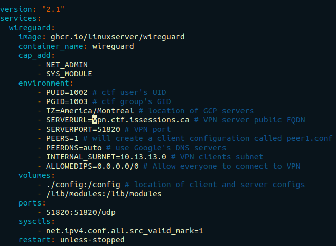
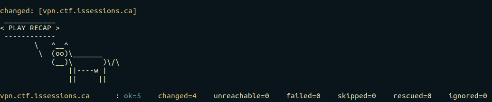
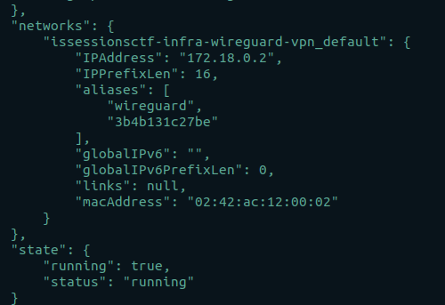
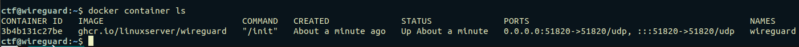

# CTF Infrastructure: Wireguard VPN Setup Stage

## Wireguard's Role
Wireguard VPN is used to provide the CTF infrastructure administrator(s) with a secure means of access to the CTF environment. Administrators will use their access to:
1. Deploy Ansible playbooks; and
2. Conduct adhoc administrative tasks as needed.

## Prerequisites
1. Ensure you have compeleted all setup steps in **0-Initial-Setup-Stage**, successfully.
2. Ensure you have run at least `1-build-network-component.sh` and `2-build-vpn-component.sh` in **1-Cloud-Resource-Provisioning-Stage**
3. Ensure you have created a DNS A record mapping your vpn's fully-qualified domain name (FQDN) to the IP address provided by `2-build-vpn-component.sh`.


## Wireguard Setup Instructions

All commands must be run on the CTF Management VM.

### Step #1: Set the `SERVERURL` Parameter in the Wireguard Configuration

Change directories into the **2-Wireguard-VPN-Setup-Stage** directory.
```
cd 2-Wireguard-VPN-Setup-Stage/
```

In `docker-compose.yml`, under the `environment` key, set the `SERVERURL` parameter to your VPN's public domain name (i.e. the one reflected in the DNS A record you created). Subsitute it in place of `vpn.ctf.issessions.ca`.



### Step #2: (Optionally) Modify the Wireguard Configuration to Suit Your Needs or Use Defaults

Modify other parameters under the `environment` key in `docker-compose.yml` as needed. A full description of each parameter can be found [here](https://hub.docker.com/r/linuxserver/wireguard).

**Important**: Remember, modifications to the default configuration must be consistent with actions taken in previous steps and may affect future steps. For example, if you want change the `SERVERPORT` parameter in `docker-compose.yml` to a different port than `51280`, you would have to change the `WG_PORT` parameter in `config.sh` in **1-Cloud-Resource-Provisioning-Stage** and execute the `2-build-vpn-component.sh` to ensure that the correct firewall port is opened to the VPN.


### Step #3: Login to Lastpass using the `lpass` Commandline Utiltiy 

Next, you must login to Lastpass to enable Ansible to retrieve CTF passwords stored in the password vault. Run:  

```
lpass login <lastpass_login_email>
```

A prompt will appear asking you for a password. If Two-Factor Authentication (2FA) is enabled (and it should be as a best practice), a second prompt will appear requesting the 2FA code.

### Step #4: Start an SSH agent and Add SSH Keys to it Keychain

Ansible playbooks in this repository run under the security context of the `ansible` and `ctf` users on the Wireguard host. Ansible needs to SSH as these users. To make Ansible aware of these user's identities (i.e. their private keys), we add their keys to the `ssh-agent`'s keychain. 

Check if the ssh-agent is running:
```
ps -aux | grep ssh-agent
```

If not, you can start one using:
```
eval `ssh-agent`
```

Next, check if the agent already has `ansible` and `ctf` users' private keys -- `~/.ssh/ansible` and `~/.ssh/ctf` -- added to the its keychain. You can check by running the following command:
```
ssh-add -l
```

If they are already added, continue to Step #5. If they are not added, run:

```
ssh-add ~/.ssh/ansible
ssh-add ~/.ssh/ctf
```

### Step #5: Set Ansible's Target Host in `inventory.yml` 

Set it to your VPN's public domain name (i.e. the one reflected in the DNS A record you created). Subsitute it in place of `vpn.ctf.issessions.ca`. Effectively, we are telling Ansible where to run the ansible playbooks (i.e. the VPN host).


### Step #6: Run Ansible Playbooks



You're all set; it's time to run the Ansible playbooks:

```
cd playbooks/
ansible-playbook 0-install-docker.yml -i inventory.yml
ansible-playbook 1-install-docker-compose.yml -i inventory.yml
ansible-playbook 2-install-stackdriver-agent.yml -i inventory.yml
ansible-playbook 3-setup-credentials.yml -i inventory.yml
ansible-playbook 4-start-vpn.yml -i inventory.yml
```

or to simply run all playbooks:
```
cd playbooks/
chmod 700 run-all-playbooks.sh
./run-all-playbooks.sh
```

**Important:** A description of each playbook's task can be found in the playbook itself.

If all playbooks execute without errors, you should see a JSON blob telling you that the Wireguard docker container was started successfully and is running.



You can verify this by SSHing into the Wireguard host manually as the `ctf`.
```
ssh ctf@<your_vpn_public_domain>
```
Then checking for running containers:
```
docker container ls
```


### Step #7: Retrieve the Wireguard Client Configuration File

Retrieve the client config and move it to `/etc/wireguard` on the administration VM.

```
scp ctf@<your_vpn_public_domain>:/home/ctf/Chik-p/2-Wireguard-VPN-Setup-Stage/config/peer1/peer1.conf /tmp/peer1.conf
sudo mv /tmp/peer1.conf /etc/wireguard/wg0.conf
```

### Step #8: Enable the Wireguard VPN Systemd Service

```
sudo systemctl enable wg-quick@wg0 
```

### Step #9: Start Wireguard VPN

Start the Wireguard service to connect to the VPN.
```
sudo systemctl start wg-quick@wg0 
```

To check if you are connected, run:
```
ip -4 a
```
And check if a `wg0` interface exists and is assigned an IP address.

Also, try pinging one of the hosts you deployed. For example, if you deployed the nginx host using `gcloud` and it has the IP `10.10.10.8`, ping it and see if you get a response back:

```
ping 10.10.10.8
```

To disconnect from the VPN, simply run:
```
sudo systemctl stop wg-quick@wg0 
```


## Wireguard Server and Client Configs

Wireguard client and server configuration files can be found in `/home/ctf/Chik-p/2-Wireguard-VPN-Setup-Stage/config/` on the Wireguard host. 

## Next Steps

If you can successfully connect to the CTF environment using Wireguard, you are ready to proceed to the **Host Configuration Stage**.
