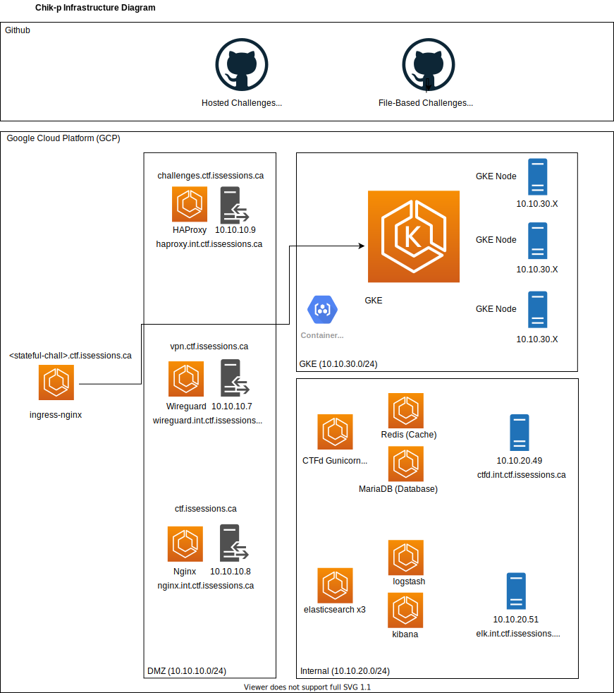

# Chik-p: A Semi-Automated CTF-Building Toolkit

## Goals

**Chik-p (pronounced "Chickpea")** is a **semi-automated** CTF-building toolkit that aims to:

- Cut down the time it takes build a Capture the Flag (CTF) environment so that CTF organizers can focus on what matters: creating unique challenges and memorable experiences for all participants
- Deliver a simple-to-use, fully-featured CTF environment that can support small to medium-sized CTFs (~200-800 participants); and to
- Leverage tools like CTFd, Ansible, Docker, and Kubernetes to deploy both file-based and hosted challenges (netcat/SSH/etc.).

Chik-p has supported several GTA-based CTFs including **ISSessionsCTF2021** and **C3X: Dark Cloud Rising**.

## Template Repository

We recognize that every CTF has its unique needs. Our #1 goal is to provide a strong starting point that CTF organizers can build on which is why this project is provided as a **Template** Github repository.

Simply click the green **"Use This Template"** button to copy this repository to your Github account.

## Project Status

This project is **very new and under active development**. As such, please aggressively test configurations before using them in production. We will make our best effort to keep the `main` branch stable and ready for use.

## Student Project
Chik-p is a project created by Information Security students at Sheridan College in Canada, specifically members of ISSessions, a student-led cybersecurity community! We welcome and appreciate all feedback. If you see any problems or have any recommendations, please open an issue to let us know :)

## Architecture

Chik-p is deployed using a combination of `gcloud` and `Ansible` to Google Cloud Platform (GCP). It leverages existing services and cloud resources including:
1. **CTFd**: to act as a scoreboard, a challenge host, and a registration and flag submission portal. 
2. **Elasticsearch, Logstash, and Kibana (ELK)**: for game statistics collection and security monitoring.
3. **Nginx**: to act as a reverse proxy and provide rate-limiting services to CTFd.
4. **Google Kubernetes Engine (GKE)**: to deploy and manage hosted challenges. 
5. **HAProxy**: to provide load balancing and rate-limiting services to TCP-based hosted challenges running as pods on GKE nodes.
6. **ingress-nginx**: to provide access and rate-limiting services to web-based hosted challenges running as pods on GKE nodes.
7. **Wireguard**: to provide CTF infrastructure administrators with secure access to the internal CTF network.

All services (CTFd, ELK, Nginx, HAProxy, and Wireguard) are packaged as `docker` images and are deployed using `docker-compose`.

The CTF's virtual private cloud (VPC) is divided into three subnets:
1. **Internal Subnet**: contains the CTFd host and the ELK host.
2. **DMZ Subnet**: contains the Nginx, HAProxy, and Wireguard hosts.
3. **Hosted Challenges Cluster Subnet**: contains the Google Kubernetes Engine (GKE) cluster and by extension ingress-nginx. This subnet is completely isolated from all other subnets for security.

Credentials are stored in (and pulled from) a LastPass password vault using the Ansible's `community.general.lastpass` module.

Hosted challenge images are pushed to a Google Container Registry (GCR) and then started as Deployments on the GKE cluster.

Chikpea's architecture assumes a **100% online CTF** (i.e. not on-premises and not behind a VPN).

Finally, the entire infrastructure build process is driven by a **CTF Infrastructure Administrator** who executes scripts and Ansible playbooks to provision cloud resources and deployes services. They perform all of these operations from a dedicated **Management VM.**

## Project Organization

This Github repository contains a number of **modules** that perform a very specific function in Chik-p's overall build process. These modules are stored in dedicated subdirectories. There are two types of modules: **Infrastructure Deployment Stages** and **Service Containers**.

Infrastructure Deployment stages are meant to be explored sequentially (i.e. 0-4). Each has a **README** containing a set of instructions and project documentation. They also contain **bash**, **gcloud**, and **Ansible** scripts that drive a specific logical component of the build process. There are 5 stages:
- **0-Initial-Setup-Stage:** explains how to generate credentials, how to set up a GCP project, and how create an administration VM for your CTF. Provides a number of helper scripts.
- **1-Cloud-Resource-Provisioning-Stage:** Contains a set of gcloud scripts that lay the foundation for your CTF by provisioning cloud resources such as hosts, GKE clusters, IP addresses, firewall rules, etc. 
- **2-Wireguard-VPN-Setup-Stage:** Contains a docker image of a Wireguard VPN as well as Ansible playbooks to provision the Wireguard VM and deploy the Wireguard service. 
- **3-Host-Configuration-Stage:** Contains Ansible playbooks to configure hosts prior to service deployment by installing needed packages, transferring credentials (SSH Keys), and manipulating system properties. 
- **4-Service-Deployment-Stage:** Contains Ansible playbooks that deploy services stored in *Service Modules* (CTFd, ELK, HAProxy, and Nginx).

Service Containers house one or more related services to be deployed during the **Service Deployment Stage**. They are 4 service containers:
- **S1-CTF-Services-ELK:** contains docker images for a 3-node elasticsearch cluster, logstash, and Kibana.
- **S2-CTF-Services-CTFd:** contains vanilla CTFd alongside a filebeat sidecar container. 
- **S3-CTF-Services-Nginx:** contains an Nginx Docker image alongside a filebeat sidecar container.
- **S4-CTF-Services-HAProxy:** contains a HAProxy Docker image.

Finally, there are two example challenge development repositories (linked as Git submodules). They provide an example organizational structure for challenge development. They are:
- **File-Based-Challenge-Dev**
- **Hosted-Challenge-Dev**

These repositories are also provided as **templates**.

**Chik-p** is divided into **modules** to:
- Simplify the maintenance of each individual logical component
- Allow us to swap services and build scripts in and out easily so long as they fulfill their abstract objective (for example, one can swap Wireguard for OpenVPN or gcloud for Terraform and still maintain the objectives of providing secure access and provisioning cloud resources, respectively).
- Clarify where a particular piece of code that *could* go anywhere *should* go 
- To make it easy to pick and choose which components to use if you do not wish to use all of them.
- To make documentation extra clear!

## Infrastructure Build Process

1. **Initial Setup Stage**
    - Create a Google Account and a Google Cloud Platform (GCP) project for the CTF
    - Set up the CTF Management VM
    - Create a Gcloud service account and activate it on the Management VM 
    - Generate SSH Keys for accounts critical to the success of the infrastructure build process
    - Create a LastPass account for the CTF infrastructure and seed it with credentials
3. **Cloud Resource Provisioning Stage**
    - Run gcloud scripts to privision cloud resources and set up the CTF's foundation (hosts, IPs, Firewall rules, etc.)
    - Configure DNS A Records for internet-facing hosts (VPN host, Nginx host, and HAProxy host).
4. **VPN Setup Stage**
    - Run Ansible playbooks to configure the Wireguard VPN host (install required packages, deploy credentials, etc.)
    - Run an Ansible playbook to deploy the Wireguard service and gain the ability to connect to the CTF's internal network
5. **Host Configuration Stage**
    - Connect to the Wireguard VPN
    - Run Ansible playbooks to configure CTFd, Nginx, HAProxy, and ELK hosts with all prerequisites for service deployment (install required packages, deploy credentials, etc.)
6. **Service Deployment Stage:**
    - Generate TLS Certificates for the CTF environment 
    - Edit and verify configuration files by following the guidance in the **Pre-Deployment Configuration Checklist** section.
    - Run Ansible playbooks to deploy CTFd, Nginx, HAProxy, and ELK
    - Check service health.
7. **Application-Layer Configuration**
    - Review and complete all items in the **Post-Deployment Configuration Checklist** section to prepare each service for game day. This includes configure CTFd options in the admin panel and creating Kibana dashboards.

## Why is it called Chik-p?

This project is dedicated to my 5 incredible partners-in-crime on the **ISSessions 2020-2021 Executive Team**. They became lifelong friends and gave me what is undoubtedly one the best years of my life, one that I will remember forever. 

They are:
- Cem **C**elen
- Nashad **H**akim
- Yusef **I**slaih
- Kurt **K**osubek
- Jamie **P**augh

Taking the first letter of each of their last names, you get **Chik-p** (prononuced "Chickpea"). Chickpeas are the main ingredient in **hummus, a heavenly substance** and the subject of many of our conversations. I can honestly say that these five chickpeas make my life taste like hummus every day. **- Louai Abboud**

## Credits

This project would not be possible without:
- **The ISSessions 2020-2021 Executive team**: they poured 1000s of hours to organize ISSessionsCTF2021, one of the largest student CTFs Ontario has ever seen!
- **The Computer Society of India at VIT University (CSIVITU)**: Much of Chik-p's design is based on CSIVITU's designs for CSICTF2020 and their exceptional articles on building a scalable CTF.
- **Clinton Huynh** and **Owen Cummings**: for being infrastructure geniuses and always guiding me in the right direction.

